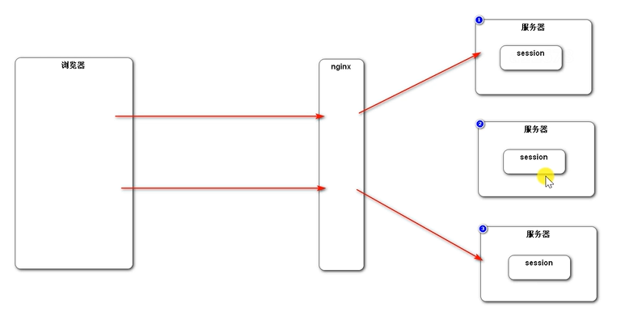
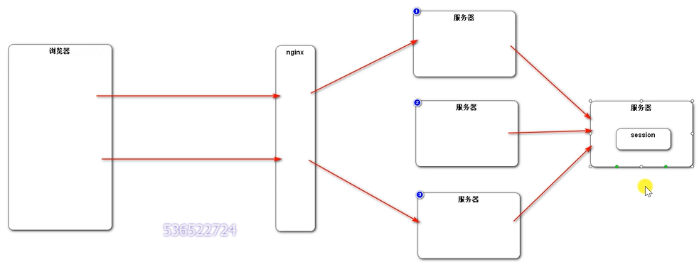
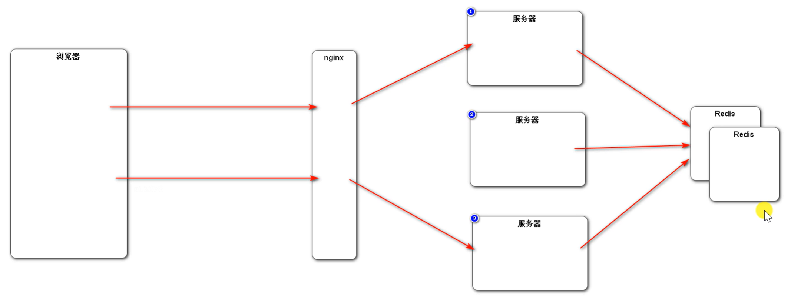
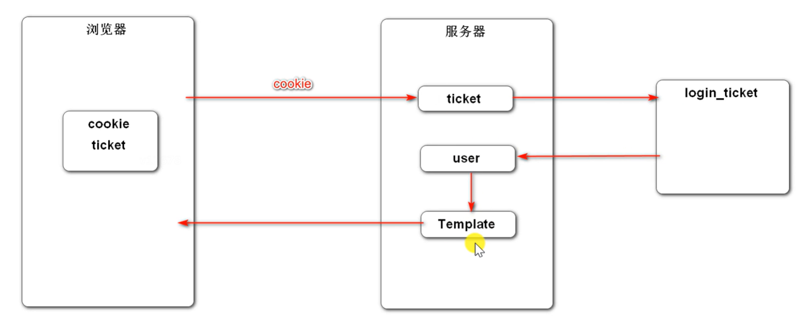

# Spring Boot实践，开发社区登录模块

## 1. 发送邮件

* 邮箱设置
  * 启用客户端SMTP服务

* Spring Email
  * 导入 jar 包
  * 邮箱参数配置
  * 使用 JavaMailSender 发送邮件
* 模板引擎
  * 使用 Thymeleaf 发送 HTML 邮件

## 2. 开发注册功能

* 访问注册页面
  * 点击顶部区域内的链接，打开注册页面。
* 提交注册数据
  * 通过表单提交数据。
  * 服务端验证账号是否已存在、邮箱是否已注册。
  * 服务端发送激活邮件。
* 激活注册账号
  * 点击邮件中的链接，访问服务端的激活服务。

## 3. 会话管理

* HTTP的基本性质
  * HTTP是简单的
  * HTTP是可扩展的
  * HTTP是无状态的，有会话的

* Cookie
  * 是服务器发送到浏览器，并保存在浏览器端的一小块数据。
  * 浏览器下次访问该服务器时，会自动携带块该数据，将其发送给服务器。

* Session
  * 是JavaEE的标准，用于在服务端记录客户端信息。
  * 数据存放在服务端更加安全，但是也会增加服务端的内存压力。

  > 
  >
  > 粘性session:失去负载均衡的意义了
  >
  > 同步session:每次都要所有服务器之间同步session，影响服务器性能，
  >
  > 共享session:共享session的服务器挂了，所有的服务器都寄了
  >
  > 
  >
  > 较优方案：redis集群
  >
  > 

  

## 4. 生成验证码

* Kaptcha
  * 导入 jar 包
  * 编写 Kaptcha 配置类
  * 生成随机字符、生成图片

## 5. 开发登录、退出功能

* 访问登录页面
  * 点击顶部区域内的链接，打开登录页面。
* 登录
  * 验证账号、密码、验证码。
  * 成功时，生成登录凭证，发放给客户端。
  * 失败时，跳转回登录页。
* 退出
  * 将登录凭证修改为失效状态。
  * 跳转至网站首页。

## 6. 显示登录信息

* 拦截器示例
  * 定义拦截器，实现HandlerInterceptor
  * 配置拦截器，为它指定拦截、排除的路径

* 拦截器应用
  * 在请求开始时查询登录用户
  * 在本次请求中持有用户数据
  * 在模板视图上显示用户数据
  * 在请求结束时清理用户数据

  > 

```c++
package com.nowcoder.community.util;

import com.nowcoder.community.entity.User;
import org.springframework.stereotype.Component;

/**
 * 持有用户的信息，用于代替session对象
 */

@Component
public class HostHolder {

    private ThreadLocal<User> users = new ThreadLocal<>();

    public void setUsers(User user) {
        users.set(user);
    }

    public User getUser(){
        return users.get();
    }

    public void clear(){
        users.remove();
    }
}
```

> 关于会话，一般是采用cookie和session，而session分布式部署时需要解决共享问题，一般就采用db来替代它。现在我们用的是mysql，将来会换成redis。我们在会话里存的是用户的登录凭证，而不是用户信息本身。我们可以通过拦截器，在请求开始将凭证置换成用户信息。为了便于在本次请求的后续部分获取到登录用户，所以我通过ThreadLocal，将其与当前线程绑定。那么问题来了，request对象就是本次请求，我们可以在请求结束前的任意时刻，从request对象里获取与本次请求有关的数据。实际上，确实可以通过request来持有用户数据的。但是从设计上、代码分层上来说，这样不好。在Spring MVC框架中，request是一个比较底层的数据对象，一般我们不直接使用它，看看你处理请求的代码就知道了。而且并不是任意的位置都方便获取request对象，因为它不被容器管理，不是随便就能注入给一个Bean的。因为不鼓励这样做，requerst是表现层的对象，要是随便注入，你很可能会将其注入给service，从而产生耦合。所以，我们自己写一个组件，单独解决这个问题。原则上可以，但事实上不会，这是从代码合理性角度考量的。

## 7. 账号设置

* 上传文件
  * 请求：必须是POST请求
  * 表单：enctype=“multipart/form-data”
  * Spring MVC：通过 MultipartFile 处理上传文件
* 开发步骤
  * 访问账号设置页面
  * 上传头像
  * 获取头像

## 8. 检查登录状态

* 使用拦截器
  * 在方法前标注自定义注解
  * 拦截所有请求，只处理带有该注解的方法
* 自定义注解
  * 常用的元注解：
    @Target、@Retention、@Document、@Inherited
* 如何读取注解：
  Method.getDeclaredAnnotations ()
  Method.getAnnotation (Class<T> annotationClass)


