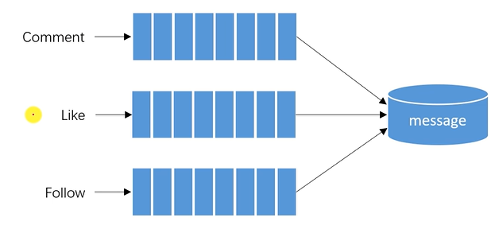

# Kafka，构建TB级异步消息系统

## 1. 阻塞队列

* BlockingQueue
  * 解决线程通信的问题。
  * 阻塞方法：put、take。


* 生产者消费者模式
  * 生产者：产生数据的线程。
  * 消费者：使用数据的线程。

* 实现类
  * ArrayBlockingQueue
  * LinkedBlockingQueue
  * PriorityBlockingQueue、SynchronousQueue、DelayQueue等。

## 2. Kafka入门

* Kafka简介
  * Kafka是一个分布式的流媒体平台。
  * 应用：消息系统、日志收集、用户行为追踪、流式处理。

* Kafka特点
  * 高吞吐量、消息持久化、高可靠性、高扩展性。

* Kafka术语
  * Broker、Zookeeper
  * Topic、Partition、Offset
  * Leader Replica 、Follower Replica

    > 配置`zookeeper.properties`
    >
    > ```bash
    > dataDir=d:/ProgramFiles/data/zookeeper
    > ```
    >
    > 配置`server.properties`
    >
    > ```bash
    > log.dirs=d:/ProgramFiles/data/kafka-logs
    > ```
    >
    > 配置消费者的组id
    >
    > ```bash
    > group.id=community-consumer-group
    > ```
    >
    > 启动kafka
    >
    > 1. 启动zookeeper
    >
    >    ```bash
    >    //用config下的zookeeper.properties配置文件 启动 zookeeper
    >    D:\software\kafka_2.12-2.3.0\bin\windows> .\zookeeper-server-start.bat ..\..\config\zookeeper.properties
    >    ```
    >
    > 2. 启动kafka
    >
    >    ```bash
    >    //以server.properties的配置 启动kafka
    >    D:\software\kafka_2.12-2.3.0> .\bin\windows\kafka-server-start.bat .\config\server.properties
    >    ```
    >
    > 3. 创建topic主题
    >
    >    ```bash
    >    //创建kafka主题：服务器地址 副本数 分区数 主题名
    >    .\kafka-topics.bat --create --bootstrap-server localhost:9092 --replication-factor 1 --partitions 1 --topic test
    >    ```
    >
    > 4. 查看某台服务器对应的主题【验证第三步】
    >
    >    ```bash
    >    .\kafka-topics.bat --list --bootstrap-server localhost:9092
    >    ```
    >
    > 5. 生产者发送消息
    >
    >    ```bash
    >    .\kafka-console-producer.bat --broker-list localhost:9092 --topic test
    >    ```
    >
    > 6. 消费者监听消息
    >
    >    ```bash
    >    //消费者监听指定服务器，指定主题的消息
    >    .\kafka-console-consumer.bat --bootstrap-server localhost:9092 --topic test --from-beginning
    >    
    >    
    >    
    >    ```
    >
    > 关闭kafka
    >
    > ```bash
    > kafka-server-stop
    > ```
    >
    > 

    

## 3. Spring整合Kafka

* 引入依赖
  * spring-kafka
* 配置Kafka
  * 配置server、consumer
* 访问Kafka
  * 生产者
    kafkaTemplate.send(topic, data);
  * 消费者
    @KafkaListener(topics = {"test"})
    public void handleMessage(ConsumerRecord record) {}


## 4. 发送系统通知

* 触发事件
  * 评论后，发布通知----->评论后，调用生产者，将评论动作封装成事件加入消息队列
  * 点赞后，发布通知----->点赞后，调用生产者，将点赞动作封装成事件加入消息队列
  * 关注后，发布通知----->关注后，调用生产者，将关注动作封装成事件加入消息队列
  
* 处理事件
  * 封装事件对象
  * 开发事件的生产者
  * 开发事件的消费者
  
  

## 5. 显示系统通知

* 通知列表
  * 显示评论、点赞、关注三种类型的通知
* 通知详情
  * 分页显示某一类主题所包含的通知
* 未读消息
  * 在页面头部显示所有的未读消息数量